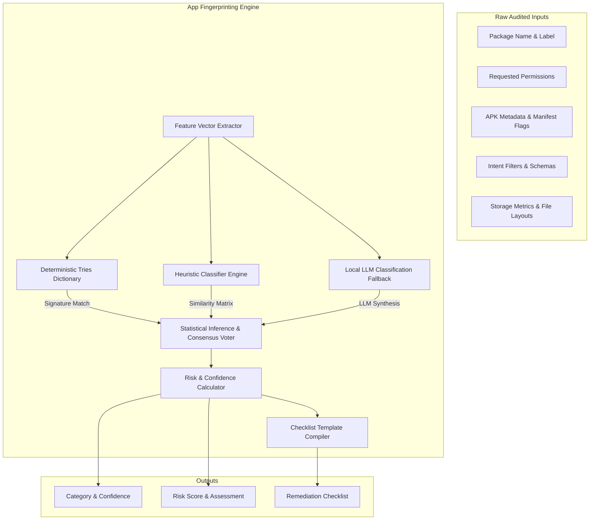

# Phoenix Backup Decision Suite: App Fingerprinting Engine Design
## Role: Principal Security Architect & Android Platform Architect
## Execution Context: 100% Offline (Local Client PC)
## Document Version: 1.0.0

---

## 1. Executive Summary & Engine Architecture

The **App Fingerprinting Engine** is the core classification and analytics processor of the Recovery Intelligence Suite. It ingests rich static and metadata vectors from audited applications and maps them to functional categories, computes confidence and risk metrics, and synthesizes migration requirements.

The engine must operate in a 100% offline, air-gapped environment. It cannot query live app stores or remote reputation networks. If a package identifier is unknown, the engine falls back to heuristic structural fingerprint matching (analyzing permissions, intents, file layouts, and backup settings) to assign profiles safely.

### 1.1 Architecture & Data Flow



---

## 2. Feature Vectorization & Classification Algorithms

The engine maps raw inputs into a structured mathematical object called the **App Feature Vector ($F$)** to perform classification checks.

### 2.1 Feature Vector Definition

For any application $a$, the feature vector is defined as:

$$F(a) = \langle \vec{P}_a, \vec{I}_a, \vec{B}_a, \vec{S}_a, \vec{L}_a \rangle$$

Where:
*   **$\vec{P}_a$ (Permission Vector):** A sparse binary vector mapped across a universe of $N_{\text{perms}}$ standard and proprietary Android permissions.
    $$\vec{P}_a[k] = \begin{cases} 1 & \text{if permission } k \text{ is requested} \\ 0 & \text{otherwise} \end{cases}$$
*   **$\vec{I}_a$ (Intent Vector):** A binary vector indicating registered schemes (e.g. `upi://`, `mailto:`, `vnd.android.cursor.dir/*`) and active intent-filter actions (e.g., `android.intent.action.SEND`).
*   **$\vec{B}_a$ (Backup Capability Flags):** A small integer vector holding flags extracted from the APK manifest:
    $$\vec{B}_a = \langle \text{allowBackup}, \text{fullBackupOnly}, \text{hasFragileUserData}, \text{restoreAnyVersion} \rangle$$
*   **$\vec{S}_a$ (Storage Distribution Vector):** Quantifies local data footprint:
    $$\vec{S}_a = \langle \text{CodeBytes}, \text{DatabaseBytes}, \text{CacheBytes}, \text{ExternalStorageBytes} \rangle$$
*   **$\vec{L}_a$ (Lexical Token Vector):** An array of tokens extracted from the package name split by period (e.g., `com.chase.sig.android` $\rightarrow$ `["com", "chase", "sig", "android"]`).

---

### 2.2 Classification Algorithm for Unknown Applications

If an application does not match any known signature in the rules database, the engine runs the following **Cosine Similarity Matching** algorithm against reference prototype vectors:

#### Step 1: Reference Profile Creation
The system maintains offline reference profile vectors ($\vec{R}_c$) representing the centroid of each category $c$ (e.g. Authenticator, Banking, Gallery). These reference profiles are built from typical permission clusters and capabilities.

#### Step 2: Similarity Calculation
For the unknown application feature vector $F(a)$, the engine computes the cosine similarity against each category reference profile:

$$\text{Sim}(a, c) = \frac{\vec{P}_a \cdot \vec{P}_{\vec{R}_c}}{\|\vec{P}_a\| \|\vec{P}_{\vec{R}_c}\|}$$

#### Step 3: Heuristic Adjustments
Adjusts similarity based on intent and metadata matches:
*   If category is `VPN` and $\vec{I}_a[\text{VpnService}] == 1$, similarity is forced to $1.0$.
*   If category is `Launcher` and $\vec{I}_a[\text{HomeIntent}] == 1$, similarity is forced to $1.0$.
*   If category is `Banking` or `UPI` and intent registers `upi://pay`, add $+0.25$ to similarity.

#### Step 4: Classification Assignment
The app is assigned to the category $c^*$ that maximizes similarity:

$$c^* = \arg\max_{c} \text{Sim}(a, c)$$

If $\max \text{Sim}(a, c) < 0.40$, the category defaults to `Unknown`.

---

## 3. Scoring Formulas

### 3.1 Confidence Scoring ($CS$)
Determines the confidence of the assigned category $c^*$:

$$CS(a) = \begin{cases} 
1.0 & \text{if package matches direct signature in rules database} \\
1.0 & \text{if matched via strict System Declarations (Layer 0)} \\
\text{Sim}(a, c^*) & \text{if matched via permission fingerprinting} \\
0.85 & \text{if evaluated by local LLM with high probability} \\
0.0 & \text{if categorized as 'Unknown'}
\end{cases}$$

---

### 3.2 Risk Scoring ($RS$)
Computes the security and recovery risk score ($RS \in [0, 100]$). High scores indicate that wiping the device will cause significant recovery hurdles or data loss.

$$RS(a) = \min\left(100, \max\left(0, RS_{\text{base}}(c^*) + \Delta RS_{\text{backup}} + \Delta RS_{\text{storage}} + \Delta RS_{\text{perms}} - \Delta RS_{\text{resolution}}\right)\right)$$

Where:
*   **$RS_{\text{base}}(c^*)$**: Baseline score of the assigned category (Authenticator/Messenger = $80$, Password Manager/Banking = $70$, Notes/Gallery = $50$, Gaming = $30$, Standard utility = $15$).
*   **$\Delta RS_{\text{backup}}$ (Backup capability modification):**
    *   If `allowBackup="false"`: Add $+15$
    *   If `fullBackupOnly="true"`: Add $+5$
*   **$\Delta RS_{\text{storage}}$ (Data complexity modification):**
    *   If `DatabaseBytes` $> 15\text{MB}$ (indicates massive offline data files): Add $+10$
    *   If the app contains subfolders in `/sdcard/Android/data/` holding files $> 100\text{MB}$: Add $+10$
*   **$\Delta RS_{\text{perms}}$ (System access modification):**
    *   If app requests `android.permission.BIND_DEVICE_ADMIN`: Add $+10$
    *   If app requests `android.permission.BIND_ACCESSIBILITY_SERVICE`: Add $+10$
    *   If app requests `android.permission.RECEIVE_SMS`: Add $+5$
*   **$\Delta RS_{\text{resolution}}$ (User confirmation modification):**
    *   If the user marks the recommendation checklist item as resolved: Subtract $-50$.

---

## 4. Rule Logic & Recommendations

The recommendation engine matches categories and risks to pre-compiled recovery requirements and backup recommendations.

```
RULE 1: Authenticator
    IF Category == "Authenticator":
        Backup Recommendation: "Local backup agents cannot read hardware-backed keystores. You must generate a manual Transfer accounts QR code."
        Recovery Requirement: "Scan the transfer QR code on your new device."

RULE 2: Encrypted Messaging
    IF Category == "Messaging" AND allowBackup == false:
        Backup Recommendation: "Turn on chat backup in the app settings to write an encrypted database file to local storage, then copy the file to PC."
        Recovery Requirement: "Copy the backup file to your new device's storage directory before opening the app, and enter your key."

RULE 3: Banking / UPI
    IF Category == "Banking" OR Category == "UPI":
        Backup Recommendation: "App data is hardware-attested and cannot be copied. Verify your online account credentials."
        Recovery Requirement: "Verify your physical SIM card is active to receive SMS identity codes on the target hardware."

RULE 4: Unknown App with High Risk
    IF Category == "Unknown" AND RiskScore >= 70:
        Backup Recommendation: "This application is unrecognized but handles encrypted files or critical permissions. Manually export configuration files if supported."
        Recovery Requirement: "Perform manual configuration setup on the target device."
```

---

## 5. Input & Output Data Contracts

These schema definitions govern serialization interfaces for the Fingerprinting Engine.

### 5.1 Input Schema (`audit_input_payload.json`)
```json
{
  "$schema": "http://json-schema.org/draft-07/schema#",
  "title": "AuditInputPayload",
  "type": "object",
  "required": [
    "package_name",
    "app_name",
    "requested_permissions",
    "apk_metadata",
    "intent_filters",
    "storage_usage"
  ],
  "properties": {
    "package_name": { "type": "string" },
    "app_name": { "type": "string" },
    "requested_permissions": {
      "type": "array",
      "items": { "type": "string" }
    },
    "apk_metadata": {
      "type": "object",
      "required": ["target_sdk", "installer_package", "shared_user_id", "allow_backup", "full_backup_only"],
      "properties": {
        "target_sdk": { "type": "integer" },
        "installer_package": { "type": ["string", "null"] },
        "shared_user_id": { "type": ["string", "null"] },
        "allow_backup": { "type": "boolean" },
        "full_backup_only": { "type": "boolean" }
      }
    },
    "intent_filters": {
      "type": "array",
      "items": {
        "type": "object",
        "required": ["action", "category", "scheme"],
        "properties": {
          "action": { "type": ["string", "null"] },
          "category": { "type": ["string", "null"] },
          "scheme": { "type": ["string", "null"] }
        }
      }
    },
    "storage_usage": {
      "type": "object",
      "required": ["code_bytes", "database_bytes", "cache_bytes", "external_bytes"],
      "properties": {
        "code_bytes": { "type": "integer" },
        "database_bytes": { "type": "integer" },
        "cache_bytes": { "type": "integer" },
        "external_bytes": { "type": "integer" }
      }
    }
  }
}
```

### 5.2 Output Schema (`fingerprint_output_report.json`)
```json
{
  "$schema": "http://json-schema.org/draft-07/schema#",
  "title": "FingerprintOutputReport",
  "type": "object",
  "required": [
    "package_name",
    "app_name",
    "application_category",
    "confidence_score",
    "risk_score",
    "recovery_requirements",
    "backup_recommendations"
  ],
  "properties": {
    "package_name": { "type": "string" },
    "app_name": { "type": "string" },
    "application_category": { "type": "string" },
    "confidence_score": { "type": "number", "minimum": 0.0, "maximum": 1.0 },
    "risk_score": { "type": "integer", "minimum": 0, "maximum": 100 },
    "recovery_requirements": {
      "type": "array",
      "items": { "type": "string" }
    },
    "backup_recommendations": {
      "type": "array",
      "items": { "type": "string" }
    }
  }
}
```
