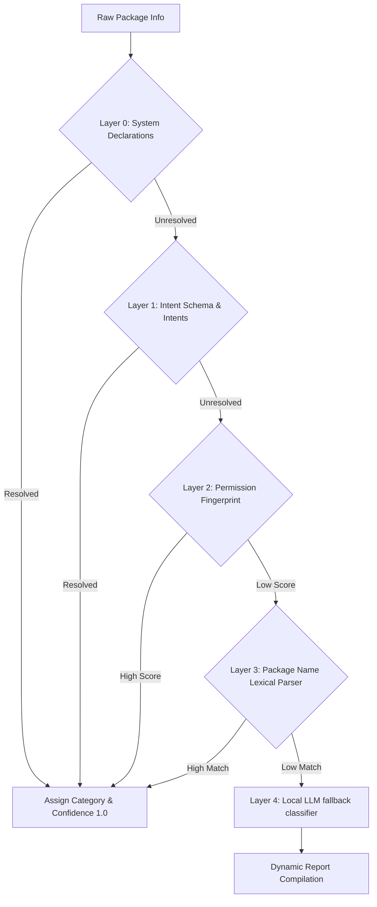

# Phoenix Backup Decision Suite: Scalable Android Application Risk Classification Framework
## Role: Principal Security Architect & Android Platform Architect
## Execution Context: 100% Offline (Local Client PC)
## Document Version: 1.0.0

---

## 1. Architectural Philosophy & Objective

This framework provides a deterministic, scalable, and fully offline methodology for classifying **any** Android application package (including those that do not exist today, OEM-specific custom packages, enterprise apps, or region-specific builds) into a structured security risk hierarchy.

Instead of maintaining an exhaustive list of package names, the framework analyzes an application's **declarative properties, Android manifest capabilities, intent registrations, system-level integrations, and permission requests** to derive its category, confidence score, risk level, and recovery instructions.

---

## 2. Category Risk Matrix

The framework classifies apps into 16 distinct categories. Below is the reference classification matrix:

| Category | Default Risk Level | Data Loss Impact | Backup Strategy | Recovery Complexity | Reinstall Priority | Core User Warning |
| :--- | :--- | :--- | :--- | :--- | :--- | :--- |
| **Authenticator** | `CRITICAL` | Complete lockout from 2FA accounts; business interruption. | Manual account QR export / sync to verified cloud. | **Extreme** | **Must** | "Resetting will delete OTP seeds. You must manually export credentials via QR codes." |
| **Banking** | `HIGH` | Loss of local transaction records, session tokens, and registered device status. | None (No-backup policy). Re-enroll on target device. | **High** | **Must** | "App data is hardware-bound. Verify your login credentials and security questions." |
| **UPI** | `HIGH` | Loss of local payment history, VPA mappings, and device activation tokens. | SMS-based SIM binding re-verification. | **High** | **Must** | "Payment interfaces require SIM card activation on the target hardware." |
| **Password Manager** | `HIGH` | Loss of offline credential databases, local-only vaults. | Synchronize vault to server / manual encrypted export. | **Medium** | **Must** | "Verify all local entries are synced to the cloud. Keep your Master Password safe." |
| **Messaging** | `CRITICAL` | Permanent deletion of chat logs, media database, and encrypted keys. | In-app backup (local `.backup` or cloud container sync). | **High** | **Should** | "End-to-end encrypted databases are local-only. Backup must be run in-app." |
| **Social Media** | `LOW` | Minor loss of local cache, transient settings, and offline drafts. | Cloud sync (automatic on authentication). | **Low** | **Could** | "Log in on the new device. Your posts and profile are stored safely in the cloud." |
| **Cloud Storage** | `MEDIUM` | Loss of offline cached files, pending upload queue. | Synchronize upload queue before resetting device. | **Low** | **Should** | "Ensure all local files are fully uploaded and synced before wiping." |
| **Notes** | `HIGH` | Loss of offline databases, voice notes, drawings, personal diaries. | Synchronize account / USB folder backup of local vault. | **Medium** | **Should** | "Local note-taking apps must have their storage folders copied to the host PC." |
| **Gallery** | `MEDIUM` | Irrecoverable loss of camera photos, videos, and screenshot files. | Direct USB media transfer (`/sdcard/DCIM/`) to host PC. | **Medium** | **Should** | "Un-synced photos will be deleted. Ensure DCIM and Pictures are synced or copied." |
| **Productivity** | `LOW` | Loss of local document drafts, custom dictionary settings. | Save files to external storage/cloud workspace. | **Low** | **Could** | "Verify that drafts are saved to your cloud workspace before reset." |
| **Email** | `LOW` | Loss of draft emails, temporary mail cache. | Server-side storage (IMAP/Exchange auto-sync). | **Low** | **Should** | "Emails are stored on the server. Sign in to download inbox logs." |
| **VPN** | `MEDIUM` | Loss of custom profiles, server configurations, private keys. | Export profiles to configuration file (`.ovpn`, `.conf`). | **Medium** | **Could** | "You will need to import your VPN profile configurations on your new device." |
| **Launcher** | `LOW` | Loss of home screen layouts, widget positions, gesture custom paths. | In-app settings export to file/cloud account. | **Medium** | **Could** | "Home layout will reset to default. Export layout configurations if supported." |
| **System Utility** | `LOW` | Loss of custom automation rules, cleanup configs. | In-app settings export. | **Low** | **Could** | "Utility apps must be reconfigured manually on the target hardware." |
| **Gaming** | `MEDIUM` | Loss of local save game progress, custom levels. | Copy `/sdcard/Android/data/<pkg>/` / Google Play Games sync. | **Medium** | **Could** | "Save progress will be lost if the game relies on local storage instead of cloud sync." |
| **Unknown** | `HIGH` | Potential loss of unrecognized business or personal assets. | Comprehensive folder sync + LLM analysis queue. | **High** | **Could** | "This application was not recognized. Verify its backup status before wiping." |

---

## 3. Detection Strategy

To classify apps dynamically, the framework runs a multi-layered evaluation pipeline using system signals, Android API definitions, and package characteristics:



### 3.1 Layer 0: System Declarations (Highest Confidence)
Determines categories using explicit declarations from the operating system or system registry.
*   **Launcher:** Scans if the package defines a component registering the intent filter:
    *   Action: `android.intent.action.MAIN`
    *   Category: `android.intent.category.HOME`
*   **VPN:** Scans if the package contains a component extending `android.net.VpnService`.
*   **System Utility:** Scans if the app matches any of the following:
    *   Declared `sharedUserId` is `android.uid.system`.
    *   Installed in the system partition (`/system/app/` or `/system/priv-app/`).
    *   Requests `android.permission.WRITE_SECURE_SETTINGS` or `android.permission.BIND_ACCESSIBILITY_SERVICE`.

### 3.2 Layer 1: Intent Schema & intent-Filters
Analyzes intent schemes registered by the application components to determine functional capabilities.
*   **UPI:** Checks if the app registers intent filters for URIs matching `upi://pay` or `upi://mandate`.
*   **Banking:** Checks for custom payment/routing schemas, e.g., `bitcoin://`, `litecoin://`, `web+pay://`.
*   **Email:** Registers intent filters for `mailto:` protocols.

### 3.3 Layer 2: Permission Fingerprinting
Calculates similarity vectors between the permissions requested by the app and typical permission profiles:

$$\text{ProfileSimilarity} = \frac{|P_{\text{app}} \cap P_{\text{template}}|}{|P_{\text{template}}|}$$

*   **Banking / UPI Profile ($P_{\text{template}}$):**
    *   `USE_BIOMETRIC`, `NFC`, `RECEIVE_SMS`, `SEND_SMS`, `READ_CONTACTS`. (Match threshold: $\ge 60\%$).
*   **Messaging Profile ($P_{\text{template}}$):**
    *   `READ_CONTACTS`, `RECEIVE_SMS`, `RECORD_AUDIO`, `CAMERA`, `WRITE_EXTERNAL_STORAGE`, `VIBRATE`. (Match threshold: $\ge 65\%$).
*   **Gallery Profile ($P_{\text{template}}$):**
    *   `READ_MEDIA_IMAGES`, `READ_MEDIA_VIDEO`, `WRITE_EXTERNAL_STORAGE`, `ACCESS_MEDIA_LOCATION`. (Match threshold: $\ge 75\%$).
*   **Unknown:** Default fallback when similarity is low across all templates.

### 3.4 Layer 3: Package Name Lexical Parser
Splits package identifiers (e.g., `com.samsung.android.messaging`) into tokens (`com`, `samsung`, `android`, `messaging`) and matches them against token weight patterns:

*   **Authenticator Keywords:** `auth`, `authenticator`, `2fa`, `totp`, `otp`, `token`, `duo`.
*   **Banking Keywords:** `bank`, `banking`, `mobilebank`, `finance`, `card`, `credit`, `broker`, `investment`.
*   **Password Manager Keywords:** `pass`, `password`, `vault`, `safe`, `keepass`, `warden`, `keyring`.
*   **Messaging Keywords:** `messenger`, `chat`, `message`, `sms`, `im`, `talk`, `whatsapp`, `signal`, `telegram`.

---

## 4. Confidence & Risk Scoring Engines

### 4.1 Confidence Scoring Engine ($CS$)
The Confidence Score ($CS \in [0.0, 1.0]$) quantifies the classification accuracy.

$$CS = \max\left(CS_{\text{system}}, \max_{c \in \text{Categories}}\left( w_{\text{intent}} \cdot I_{\text{intent}}(c) + w_{\text{perm}} \cdot \text{Sim}_{\text{perm}}(c) + w_{\text{lex}} \cdot S_{\text{lex}}(c) \right)\right)$$

Where:
*   **$CS_{\text{system}}$**: Set to $1.0$ if classified via Layer 0 (System Declarations).
*   **$w_{\text{intent}} = 0.5$**, **$w_{\text{perm}} = 0.3$**, **$w_{\text{lex}} = 0.2$** (weights summing to $1.0$).
*   **$I_{\text{intent}}(c)$**: Binary indicator ($1$ if intent matches category $c$, $0$ otherwise).
*   **$\text{Sim}_{\text{perm}}(c)$**: Profile similarity score ($[0,1]$) against category $c$ permission fingerprint.
*   **$S_{\text{lex}}(c)$**: Normalized lexical match score ($[0,1]$) based on token overlaps.

*Fallback Logic:* If $\max(CS) < 0.70$, the category is assigned as `Unknown`, and the package is queued for Layer 4 (Local LLM verification). If LLM returns a match, confidence is set to $0.85$.

---

### 4.2 Risk Scoring Engine ($RS$)
Calculates the quantitative security/migration risk score ($RS \in [0, 100]$) for any audited package $a$:

$$RS(a) = \min\left(100, \max\left(0, RS_{\text{base}}(\text{Category}) + \Delta RS_{\text{backup}} + \Delta RS_{\text{perms}} - \Delta RS_{\text{sync}}\right)\right)$$

Where:
1.  **$RS_{\text{base}}$**: Base score of the category:
    *   `CRITICAL` categories (Authenticator, Messaging) = $80$
    *   `HIGH` categories (Banking, UPI, Password Manager, Notes) = $65$
    *   `MEDIUM` categories (Cloud Storage, Gallery, VPN, Gaming) = $45$
    *   `LOW` categories (Social Media, Productivity, Email, Launcher, System Utility) = $20$
2.  **$\Delta RS_{\text{backup}}$ (Manifest Vulnerability modifier):**
    *   If `allowBackup="false"` in AndroidManifest: $+15$
    *   If `hasFragileUserData="true"` in AndroidManifest: $-5$
3.  **$\Delta RS_{\text{perms}}$ (High-Risk Privilege modifier):**
    *   Adds $+2$ for each high-privilege permission requested: `BIND_DEVICE_ADMIN`, `BIND_ACCESSIBILITY_SERVICE`, `READ_SMS`, `RECEIVE_SMS`, `QUERY_ALL_PACKAGES`.
4.  **$\Delta RS_{\text{sync}}$ (Verified Sync modifier):**
    *   If the user has verified a backup/cloud sync state (e.g. checked "Aegis exported"): $-40$.

---

## 5. Recovery Recommendation Rules

The recommendation engine generates dynamic restoration guides using the computed risk score ($RS$) and categorization:

```
IF Category == "Authenticator" AND RS >= 70:
    Priority = "MUST"
    Action = "Manual QR Export Required"
    Step = "Open the application settings and select account transfer. Save the QR code securely."

IF Category == "Messaging" AND allowBackup == false:
    Priority = "MUST"
    Action = "In-App Backup Extraction"
    Step = "Go to App Settings -> Backups, select local file creation, and copy the encrypted database files to the host PC."

IF Category == "Banking" OR Category == "UPI":
    Priority = "SHOULD"
    Action = "Credentials and SIM verification check"
    Step = "Verify you have access to the registered physical SIM card. Have MFA login parameters ready."
```

---

## 6. Schema Configurations

### 6.1 Classification Schema (`app_classification_rules.json`)
Defines the local schema used to configure heuristic categories, permissions, and lexical tokens offline.

```json
{
  "$schema": "http://json-schema.org/draft-07/schema#",
  "title": "ApplicationClassificationRules",
  "type": "object",
  "required": ["categories"],
  "properties": {
    "categories": {
      "type": "array",
      "items": {
        "type": "object",
        "required": ["category_name", "risk_level", "lexical_keywords", "target_permissions"],
        "properties": {
          "category_name": { "type": "string" },
          "risk_level": { "type": "string", "enum": ["CRITICAL", "HIGH", "MEDIUM", "LOW"] },
          "lexical_keywords": {
            "type": "array",
            "items": { "type": "string" }
          },
          "target_permissions": {
            "type": "array",
            "items": { "type": "string" }
          }
        }
      }
    }
  }
}
```

### 6.2 Audit Classification Output Schema (`classification_output.json`)
The structured payload returned by the classification engine for each evaluated application.

```json
{
  "$schema": "http://json-schema.org/draft-07/schema#",
  "title": "ClassificationResult",
  "type": "object",
  "required": ["package_name", "app_name", "category", "confidence_score", "risk_score", "risk_level", "system_flags", "recommendation"],
  "properties": {
    "package_name": { "type": "string" },
    "app_name": { "type": "string" },
    "category": { "type": "string" },
    "confidence_score": { "type": "number", "minimum": 0.0, "maximum": 1.0 },
    "risk_score": { "type": "integer", "minimum": 0, "maximum": 100 },
    "risk_level": { "type": "string", "enum": ["CRITICAL", "HIGH", "MEDIUM", "LOW"] },
    "system_flags": {
      "type": "object",
      "required": ["allow_backup", "system_app", "shared_system_uid"],
      "properties": {
        "allow_backup": { "type": "boolean" },
        "system_app": { "type": "boolean" },
        "shared_system_uid": { "type": "boolean" }
      }
    },
    "recommendation": {
      "type": "object",
      "required": ["priority", "action_required", "instruction"],
      "properties": {
        "priority": { "type": "string", "enum": ["MUST", "SHOULD", "COULD"] },
        "action_required": { "type": "string" },
        "instruction": { "type": "string" }
      }
    }
  }
}
```

---

## 7. Database Schema Extensions (SQLite)

These SQL definitions store classifications, risk profiles, and heuristic data tables on the host PC's local database pool.

```sql
-- Table: app_categories
-- Holds static category details, default risk values, and weights.
CREATE TABLE IF NOT EXISTS app_categories (
    category_id INTEGER PRIMARY KEY AUTOINCREMENT,
    category_name TEXT UNIQUE NOT NULL,
    default_risk_level TEXT NOT NULL CHECK(default_risk_level IN ('CRITICAL', 'HIGH', 'MEDIUM', 'LOW')),
    base_risk_score INTEGER NOT NULL CHECK(base_risk_score BETWEEN 0 AND 100),
    reinstall_priority TEXT NOT NULL CHECK(reinstall_priority IN ('MUST', 'SHOULD', 'COULD'))
);

-- Table: app_risk_heuristics
-- Stores dynamic heuristic configurations (permission clusters and lexical match tokens).
CREATE TABLE IF NOT EXISTS app_risk_heuristics (
    heuristic_id INTEGER PRIMARY KEY AUTOINCREMENT,
    category_name TEXT NOT NULL,
    heuristic_type TEXT NOT NULL CHECK(heuristic_type IN ('PERMISSION', 'LEXICAL', 'INTENT')),
    pattern_value TEXT NOT NULL,
    FOREIGN KEY (category_name) REFERENCES app_categories(category_name) ON DELETE CASCADE
);

-- Table: device_app_classifications
-- Stores audit results for scanned packages on scanned devices.
CREATE TABLE IF NOT EXISTS device_app_classifications (
    classification_id INTEGER PRIMARY KEY AUTOINCREMENT,
    device_id TEXT NOT NULL,
    package_name TEXT NOT NULL,
    app_name TEXT NOT NULL,
    assigned_category TEXT NOT NULL DEFAULT 'Unknown',
    confidence_score REAL NOT NULL CHECK(confidence_score BETWEEN 0.0 AND 1.0),
    computed_risk_score INTEGER NOT NULL CHECK(computed_risk_score BETWEEN 0 AND 100),
    computed_risk_level TEXT NOT NULL CHECK(computed_risk_level IN ('CRITICAL', 'HIGH', 'MEDIUM', 'LOW')),
    allow_backup INTEGER NOT NULL CHECK(allow_backup IN (0, 1)),
    is_system_app INTEGER NOT NULL CHECK(is_system_app IN (0, 1)),
    resolved_by_user INTEGER NOT NULL CHECK(resolved_by_user IN (0, 1)) DEFAULT 0,
    last_audited_at DATETIME DEFAULT CURRENT_TIMESTAMP,
    FOREIGN KEY (assigned_category) REFERENCES app_categories(category_name),
    UNIQUE(device_id, package_name)
);

-- Table: classification_overrides
-- Stores user-configured classification overrides and consent states.
CREATE TABLE IF NOT EXISTS classification_overrides (
    package_name TEXT PRIMARY KEY,
    user_assigned_category TEXT NOT NULL,
    override_reason TEXT,
    created_at DATETIME DEFAULT CURRENT_TIMESTAMP,
    FOREIGN KEY (user_assigned_category) REFERENCES app_categories(category_name)
);

-- Index optimization for audit scans
CREATE INDEX IF NOT EXISTS idx_classifications_device ON device_app_classifications(device_id);
CREATE INDEX IF NOT EXISTS idx_classifications_pkg ON device_app_classifications(package_name);
```
