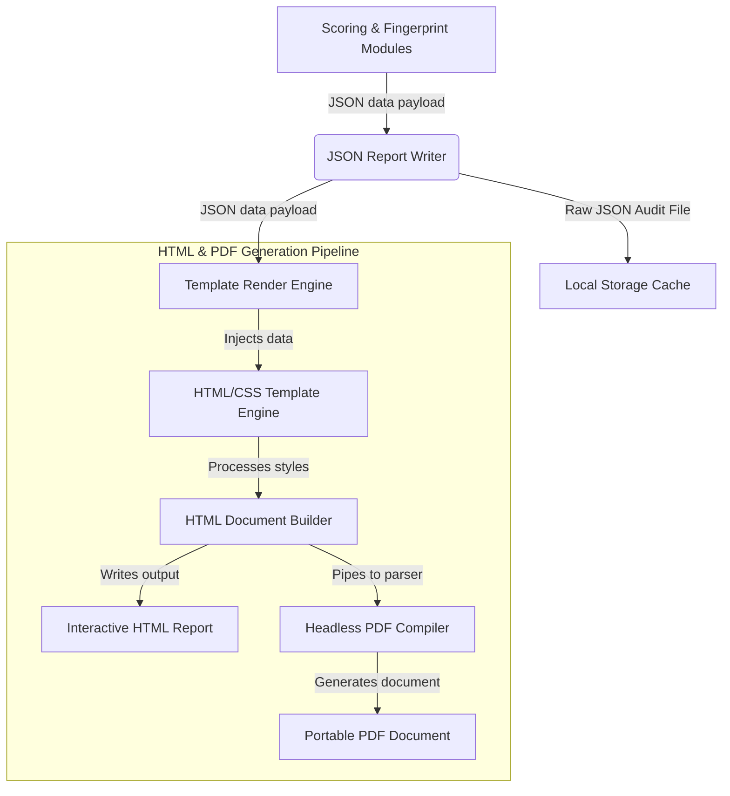

# Phoenix Backup Decision Suite: Backup Report Generator Design
## Role: Principal Security Architect & Android Platform Architect
## Execution Context: 100% Offline (Local Client PC)
## Document Version: 1.0.0

---

## 1. Executive Summary & Rendering Pipeline

The **Backup Report Generator** compiles the analytical outputs of the App Fingerprinting Engine and the Recovery Readiness Scoring System into user-facing artifacts. It supports three target formats:
1.  **JSON Report:** Machine-readable raw audit trail for integrations and database persistence.
2.  **HTML Report:** Highly responsive interactive report rendered in the Phoenix desktop dashboard.
3.  **PDF Report:** Print-optimized portable document for physical archives or offline reference.

### 1.1 Rendering Pipeline Architecture



---

## 2. Report Data Contract (JSON Schema)

The JSON report holds all device parameters, classifications, scores, findings, and checklist instructions.

```json
{
  "$schema": "http://json-schema.org/draft-07/schema#",
  "title": "BackupReportPayload",
  "type": "object",
  "required": [
    "report_id",
    "generated_at",
    "device_summary",
    "readiness_score",
    "readiness_state",
    "audit_trail",
    "risk_findings",
    "remediation_checklist",
    "application_inventory"
  ],
  "properties": {
    "report_id": { "type": "string" },
    "generated_at": { "type": "string", "format": "date-time" },
    "device_summary": {
      "type": "object",
      "required": ["device_name", "model", "serial", "android_version", "api_level", "total_storage_bytes", "used_storage_bytes"],
      "properties": {
        "device_name": { "type": "string" },
        "model": { "type": "string" },
        "serial": { "type": "string" },
        "android_version": { "type": "string" },
        "api_level": { "type": "integer" },
        "total_storage_bytes": { "type": "integer" },
        "used_storage_bytes": { "type": "integer" }
      }
    },
    "readiness_score": { "type": "integer", "minimum": 0, "maximum": 100 },
    "readiness_state": { "type": "string", "enum": ["READY", "WARNING", "CRITICAL_UNPREPARED"] },
    "audit_trail": {
      "type": "object",
      "required": ["core_score", "storage_score", "apps_score"],
      "properties": {
        "core_score": { "type": "integer" },
        "storage_score": { "type": "integer" },
        "apps_score": { "type": "integer" }
      }
    },
    "risk_findings": {
      "type": "array",
      "items": {
        "type": "object",
        "required": ["package_name", "app_name", "category", "severity", "reasoning", "remediation", "resolved"],
        "properties": {
          "package_name": { "type": "string" },
          "app_name": { "type": "string" },
          "category": { "type": "string" },
          "severity": { "type": "string", "enum": ["CRITICAL", "HIGH", "MEDIUM", "LOW"] },
          "reasoning": { "type": "string" },
          "remediation": { "type": "string" },
          "resolved": { "type": "boolean" }
        }
      }
    },
    "remediation_checklist": {
      "type": "array",
      "items": {
        "type": "object",
        "required": ["task_id", "priority", "timing", "instruction", "status"],
        "properties": {
          "task_id": { "type": "string" },
          "priority": { "type": "string", "enum": ["MUST", "SHOULD", "COULD"] },
          "timing": { "type": "string", "enum": ["PRE_RESET", "POST_RESTORE"] },
          "instruction": { "type": "string" },
          "status": { "type": "string", "enum": ["PENDING", "COMPLETED"] }
        }
      }
    },
    "application_inventory": {
      "type": "array",
      "items": {
        "type": "object",
        "required": ["package_name", "app_name", "version_name", "allow_backup", "risk_score"],
        "properties": {
          "package_name": { "type": "string" },
          "app_name": { "type": "string" },
          "version_name": { "type": "string" },
          "allow_backup": { "type": "boolean" },
          "risk_score": { "type": "integer" }
        }
      }
    }
  }
}
```

---

## 3. Report Section Breakdown

### Section 1: Executive Dashboard
*   **Purpose:** Instant overview of recovery state.
*   **Visual Assets:**
    *   Circular gauge representing the dynamic Readiness Score ($S$).
    *   Color-coded badge for **Readiness State** (`READY` $\rightarrow$ Green, `WARNING` $\rightarrow$ Yellow, `CRITICAL_UNPREPARED` $\rightarrow$ Red).
    *   Brief status statement summarizing outstanding tasks (e.g., *"Core files secure, but 1 critical item requires attention before wipe"*).

### Section 2: Actionable Remediation Checklist
*   **Purpose:** Organized tasks showing what the user must execute manually before and after reset.
*   **Grouping:**
    1.  **PRE-RESET Tasks (MUST Priority):** Actions that will cause permanent data loss if skipped (e.g., authenticator export).
    2.  **PRE-RESET Tasks (SHOULD/COULD Priority):** Sync tasks to reduce migration friction (e.g., gallery folder copies).
    3.  **POST-RESTORE Tasks:** Re-registration steps required after restoration (e.g., banking activation, SIM transfers).

### Section 3: Detailed Risk Findings
*   **Purpose:** Explain the technical reasons behind flagged apps.
*   **Format:** A list of cards containing:
    *   AppName, PackageName, Risk Category, and Severity.
    *   **Reasoning:** Technical explanation (e.g., *Keystore bindings prevent file extractions*).
    *   **Remediation:** Step-by-step instructions.

### Section 4: Complete Application Inventory
*   **Purpose:** Verification table listing all analyzed packages.
*   **Columns:** Package Name, App Label, App Version, Android Backup Flag (`allowBackup`), and calculated Risk Score.

---

## 4. HTML & CSS Report Template Specification

The HTML/CSS templates use a clean layout utilizing CSS variables for consistent formatting.

### 4.1 HTML Struct Template Blueprint (`report_template.html`)
```html
<!DOCTYPE html>
<html lang="en">
<head>
  <meta charset="UTF-8">
  <title>Phoenix Recovery Readiness Report - {{ device_summary.model }}</title>
  <style>
    :root {
      --primary: #0F172A;
      --accent: #2563EB;
      --bg: #F8FAFC;
      --card-bg: #FFFFFF;
      --border: #E2E8F0;
      
      /* Severity Colors */
      --critical: #EF4444;
      --high: #F97316;
      --medium: #F59E0B;
      --low: #10B981;
    }
    
    body {
      font-family: 'Inter', system-ui, sans-serif;
      background-color: var(--bg);
      color: var(--primary);
      margin: 0;
      padding: 40px;
    }
    
    .container {
      max-width: 1000px;
      margin: 0 auto;
    }
    
    .header {
      display: flex;
      justify-content: space-between;
      align-items: center;
      border-bottom: 2px solid var(--border);
      padding-bottom: 20px;
      margin-bottom: 30px;
    }
    
    .dashboard-grid {
      display: grid;
      grid-template-columns: 1fr 2fr;
      gap: 30px;
      margin-bottom: 40px;
    }
    
    .card {
      background-color: var(--card-bg);
      border: 1px solid var(--border);
      border-radius: 12px;
      padding: 24px;
      box-shadow: 0 1px 3px rgba(0, 0, 0, 0.05);
    }
    
    .gauge-container {
      text-align: center;
      display: flex;
      flex-direction: column;
      align-items: center;
      justify-content: center;
    }
    
    .score-circle {
      width: 140px;
      height: 140px;
      border-radius: 50%;
      border: 10px solid var(--border);
      display: flex;
      align-items: center;
      justify-content: center;
      font-size: 3rem;
      font-weight: 800;
      margin-bottom: 15px;
    }
    
    .state-badge {
      display: inline-block;
      padding: 6px 12px;
      border-radius: 9999px;
      font-weight: 700;
      text-transform: uppercase;
      font-size: 0.85rem;
    }
    
    .state-ready { background-color: #D1FAE5; color: #065F46; }
    .state-warning { background-color: #FEF3C7; color: #92400E; }
    .state-critical { background-color: #FEE2E2; color: #991B1B; }

    .checklist-table, .inventory-table {
      width: 100%;
      border-collapse: collapse;
      margin-top: 15px;
    }
    
    .checklist-table th, .checklist-table td, 
    .inventory-table th, .inventory-table td {
      border: 1px solid var(--border);
      padding: 12px;
      text-align: left;
    }
    
    .checklist-table th, .inventory-table th {
      background-color: #F1F5F9;
    }

    .finding-card {
      border-left: 6px solid var(--border);
      margin-bottom: 20px;
      padding: 18px;
    }
    
    .severity-critical { border-left-color: var(--critical); }
    .severity-high { border-left-color: var(--high); }
    .severity-medium { border-left-color: var(--medium); }
    .severity-low { border-left-color: var(--low); }

    /* PDF Print Styles override */
    @media print {
      body {
        padding: 0;
        background-color: #FFF;
      }
      .container {
        max-width: 100%;
      }
      .card {
        box-shadow: none;
        page-break-inside: avoid;
      }
      .page-break {
        page-break-before: always;
      }
    }
  </style>
</head>
<body>
  <div class="container">
    <div class="header">
      <div>
        <h1>Phoenix Recovery Readiness Report</h1>
        <p>Generated on: {{ generated_at }}</p>
      </div>
      <div>
        <span class="state-badge state-{{ readiness_state | lower }}">{{ readiness_state }}</span>
      </div>
    </div>

    <!-- Section 1: Dashboard -->
    <div class="dashboard-grid">
      <div class="card gauge-container">
        <h3>Readiness Score</h3>
        <div class="score-circle" style="border-color: var(--low)var(--medium)var(--critical)">
          {{ readiness_score }}
        </div>
        <p><strong>Device:</strong> {{ device_summary.model }}</p>
        <p><strong>Android:</strong> Version {{ device_summary.android_version }} (API {{ device_summary.api_level }})</p>
      </div>
      
      <div class="card">
        <h3>Device Backup Progress</h3>
        <p><strong>Contacts Status:</strong> ✅ Secure❌ Missing</p>
        <p><strong>SMS logs Status:</strong> ✅ Secure❌ Missing</p>
        <p><strong>Call history Status:</strong> ✅ Secure❌ Missing</p>
        <p><strong>Storage Synced:</strong> {{ device_summary.used_storage_bytes | filesizeformat }} of {{ device_summary.total_storage_bytes | filesizeformat }}</p>
      </div>
    </div>

    <!-- Section 2: Actionable Checklist -->
    <div class="card" style="margin-bottom: 40px;">
      <h3>Actionable Recovery Checklist</h3>
      <table class="checklist-table">
        <thead>
          <tr>
            <th>Priority</th>
            <th>Timing</th>
            <th>Instruction</th>
            <th>Status</th>
          </tr>
        </thead>
        <tbody>
          
          <tr>
            <td><strong>{{ item.priority }}</strong></td>
            <td>{{ item.timing }}</td>
            <td>{{ item.instruction }}</td>
            <td>{{ item.status }}</td>
          </tr>
          
        </tbody>
      </table>
    </div>

    <!-- Section 3: Risk Findings -->
    <div class="card page-break" style="margin-bottom: 40px;">
      <h3>Outstanding Application Recovery Risks</h3>
      
      <div class="card finding-card severity-{{ finding.severity | lower }}">
        <div style="display: flex; justify-content: space-between;">
          <h4>{{ finding.app_name }} ({{ finding.package_name }})</h4>
          <span style="font-weight: bold; color: var(--{{ finding.severity | lower }});">{{ finding.severity }}</span>
        </div>
        <p><strong>Technical Constraint:</strong> {{ finding.reasoning }}</p>
        <p><strong>Required User Action:</strong> {{ finding.remediation }}</p>
      </div>
      
    </div>

    <!-- Section 4: Inventory -->
    <div class="card page-break">
      <h3>Complete Application Inventory</h3>
      <table class="inventory-table">
        <thead>
          <tr>
            <th>App Name</th>
            <th>Package Name</th>
            <th>Version</th>
            <th>Allow Backup</th>
            <th>Risk Score</th>
          </tr>
        </thead>
        <tbody>
          
          <tr>
            <td>{{ app.app_name }}</td>
            <td><code>{{ app.package_name }}</code></td>
            <td>{{ app.version_name }}</td>
            <td>{{ app.allow_backup }}</td>
            <td>{{ app.risk_score }}</td>
          </tr>
          
        </tbody>
      </table>
    </div>

  </div>
</body>
</html>
```

---

## 5. UX and Print Optimization Considerations

### 5.1 Explainability and User Anxiety Reduction
*   **Wording Tone:** Keep technical language simple. Frame problems constructively. Avoid panic-inducing terms like *"System Compromise"* or *"Device Insecure"*. Instead, use *"Manual Backup Required"* or *"Hardware-attested Credentials"*.
*   **Actionable Primacy:** Place the checklist directly beneath the score. Users want to know *how to resolve the issue* before understanding the technical constraints.

### 5.2 Print-Media and PDF Layout Rules (Orphan/Window Protection)
*   **Page-Break Controls:** Apply `page-break-inside: avoid` on checklist cards, risk finding cards, and summary blocks. This prevents a single app risk card from being split across two physical printed pages.
*   **Table Header Repeat:** Utilize standard CSS print features to repeat `<thead>` rows automatically if the inventory table spans multiple pages.
    ```css
    thead { display: table-header-group; }
    tr { page-break-inside: avoid; }
    ```
*   **Margin Safety:** Keep top and bottom margins at a minimum of `20mm` for PDF compiles to prevent headers or page numbering from being clipped by printer margins.
