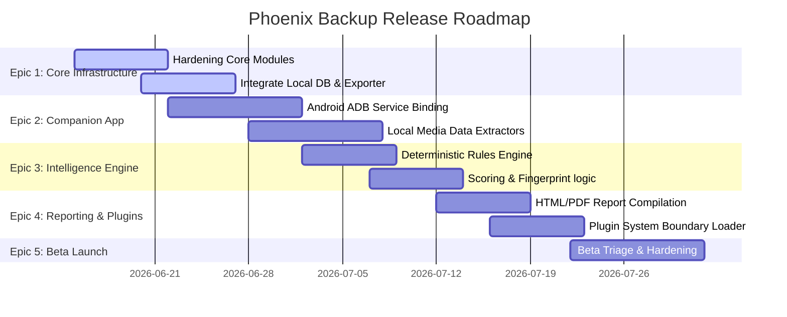

# Phoenix Backup: GitHub Project Structure & Setup Guide
## Role: Lead Release Manager & Scrum Master
## Document Version: 1.0.0
## Execution Context: 100% Offline (Local Client PC)

---

## 1. Project Organization & Board Views

To effectively manage the development of the Phoenix Backup platform, the GitHub Project utilizes a unified Kanban/Gantt workspace. The project board is organized into five primary views:

1.  **Roadmap (Gantt View):** Tracks Epics across time intervals.
2.  **Product Backlog (Table View):** Grouped by Epic/Feature, sorted by priority.
3.  **Active Sprint Board (Board View):** Column states: `Todo` $\rightarrow$ `In Progress` $\rightarrow$ `Code Review` $\rightarrow$ `QA Verify` $\rightarrow$ `Done`.
4.  **Milestone View (Timeline):** Displays release timelines and feature completeness checks.
5.  **Risk Audit & Defect Tracker (Table View):** Filters issues labeled with `type/bug` or `type/security-gap`.

---

## 2. Standard Labels Schema

GitHub Issues must be tagged using the following color-coded classification system:

| Label Category | Label Name | Color | Description |
| :--- | :--- | :--- | :--- |
| **Hierarchies** | `epic` | `#0E8A16` | Broad functional block spanning multiple sprints. |
| | `feature` | `#D93F0B` | Component-level functionality. |
| | `user-story` | `#FBCA04` | Value-oriented description of a feature. |
| **Work Item Types**| `type/task` | `#8F94A0` | Micro-task or engineering task. |
| | `type/bug` | `#D93F0B` | Code failure or functional regression. |
| | `type/security-gap`| `#B60205` | Security vulnerability identified in audit. |
| **Components** | `comp/android` | `#3DDC84` | Android Companion App code base. |
| | `comp/desktop` | `#1D76DB` | Desktop client controller / ADB scripts. |
| | `comp/engine` | `#673AB7` | Recovery Intelligence scoring/rules logic. |
| | `comp/plugin` | `#E91E63` | Extensible plugin loading framework. |
| **Priorities** | `priority/P0` | `#B60205` | Showstopper/Blocker. Must resolve immediately. |
| | `priority/P1` | `#D93F0B` | Critical feature blocker. |
| | `priority/P2` | `#FBCA04` | Standard backlog requirement. |
| | `priority/P3` | `#0E8A16` | Minor improvement or cosmetic change. |

---

## 3. Milestones Setup

*   **Milestone 1: Sprint 1 Core Hardening (Target: 2 Weeks)**
    *   *Goal:* Clean open security gaps and implement core Windows/ADB pipeline integrations.
*   **Milestone 2: Sprint 2 Intelligence & Companion App (Target: 3 Weeks)**
    *   *Goal:* Build Android companion service app, scoring engine, rules parsing database, and HTML reporting.
*   **Milestone 3: Phoenix Backup v0.1 Beta Release (Target: 2 Weeks)**
    *   *Goal:* Execute beta testing, bug triage, performance checks, and release packaging.

---

## 4. Epics & Features Roadmap

---

## 5. Epics, User Stories, and Task List

### Epic 1: Device Communication & Core Orchestration
*   *Milestone:* Milestone 1 (Sprint 1 Core Hardening)

#### User Story 1.1: Core Module Hardening
*   **As a** system user,
*   **I want** the local backup client to execute securely on Windows without administrative privileges,
*   **So that** my data is backed up to SQLite and exported to CSV without platform-level security violations.
*   **Acceptance Criteria:**
    *   Sideloaded `adb.exe` runs safely under Windows Defender without triggering warnings.
    *   Temporary directory paths are created strictly within the user workspace.
    *   All DB connections use pool closures to prevent file locks.
*   **Tasks:**
    *   [ ] Refactor ADB execution directory configurations to locate within standard workspace structures.
    *   [ ] Wrap SQLite cursor calls in contextual managers (`with` statements) to prevent file system locking.
    *   [ ] Verify CSV writer escape sequences to prevent CSV injection vulnerabilities.
    *   [ ] Run Python unit tests and ensure code coverage is $\ge 85\%$.

---

### Epic 2: Android Companion Service
*   *Milestone:* Milestone 2 (Sprint 2 Intelligence & Companion App)

#### User Story 2.1: Non-Root Android Data Extraction
*   **As a** user performing recovery steps,
*   **I want** the companion app to export my contacts, SMS, and call logs to the desktop app over an ADB socket,
*   **So that** I don't need to root my Android device to secure my data.
*   **Acceptance Criteria:**
    *   Companion app runs on Android 11 up to Android 14.
    *   Correctly requests runtime contacts and SMS permissions from the user.
    *   Exposes a port-forwarded localhost port for ADB client socket data pulls.
*   **Tasks:**
    *   [ ] Initialize the companion app project using Gradle and Java.
    *   [ ] Set up intent bindings for SMS and Contact provider queries.
    *   [ ] Implement the server socket loop on port `10420` to stream backup payloads.
    *   [ ] Build verification scripts to confirm socket payloads are valid JSON.

---

### Epic 3: Recovery Intelligence Engine
*   *Milestone:* Milestone 2 (Sprint 2 Intelligence & Companion App)

#### User Story 3.1: Readiness Score Assessment
*   **As a** migrating user,
*   **I want** the desktop application to show me a readiness score from 0 to 100,
*   **So that** I know if it is safe to wipe my old phone or if I need to perform manual backup steps.
*   **Acceptance Criteria:**
    *   Base backups (Contacts, SMS, Call logs) contribute a maximum of 45 points.
    *   Unresolved high-risk findings (e.g., active authenticator apps) subtract penalties from the base score.
    *   User resolution overrides recalculate the score instantly.
*   **Tasks:**
    *   [ ] Code the mathematical scoring formula logic, including dynamic tablet weight distribution.
    *   [ ] Build the deterministic rules engine matching packages against `app_rules.json`.
    *   [ ] Integrate `llama.cpp` wrapper bindings to classify unknown packages using GBNF grammar.
    *   [ ] Write scoring unit tests validating boundary cases (score clamps at 0 and 100).

---

### Epic 4: Reporting & Plugin Suite
*   *Milestone:* Milestone 2 (Sprint 2 Intelligence & Companion App)

#### User Story 4.1: Portable Backup Report
*   **As a** user preparing to migrate devices,
*   **I want** to export an HTML or PDF report containing my readiness score and recovery checklist,
*   **So that** I can follow the instructions on my computer during the reset process.
*   **Acceptance Criteria:**
    *   HTML report renders correctly in desktop views.
    *   PDF output matches HTML layout exactly with page-break boundaries preventing split cards.
    *   Checklist displays steps grouped by timing (`PRE_RESET` vs `POST_RESTORE`).
*   **Tasks:**
    *   [ ] Implement Jinja2 template rendering engines for HTML reports.
    *   [ ] Configure CSS variables and print-media rules (`page-break-inside: avoid`).
    *   [ ] Integrate offline PDF compiler bindings (e.g. WeasyPrint library).
    *   [ ] Add mock payload generators to test report rendering without physical devices.

#### User Story 4.2: Decoupled Plugin Loading
*   **As a** system architect,
*   **I want** the desktop app to load custom analyzers (like WhatsApp database checkers) from an isolated directory,
*   **So that** I can write extensions without modifying the core orchestrator codebase.
*   **Acceptance Criteria:**
    *   Host searches `%APPDATA%/plugins/` on startup.
    *   Plugins are loaded into isolated ClassLoaders.
    *   Enforces semantic version checks against host API versions.
*   **Tasks:**
    *   [ ] Implement the directory scanner and `plugin.json` manifest validator.
    *   [ ] Construct isolated runtime namespaces for plugins.
    *   [ ] Implement permissions check gatekeepers to block unauthorized network calls.

---

### Epic 5: Release Hardening & Beta Launch
*   *Milestone:* Milestone 3 (Phoenix Backup v0.1 Beta Release)

#### User Story 5.1: Package Assembly & Beta Validation
*   **As a** Release Engineer,
*   **I want** to build an air-gapped executable package of the application and run beta tests,
*   **So that** we can identify and resolve any critical bugs before the official release.
*   **Acceptance Criteria:**
    *   PyInstaller bundles all Python, ADB, and static rules files into a single Windows executable.
    *   Beta test sessions verify zero P0/P1 bugs remain open.
    *   Users can export local execution logs for offline bug reporting.
*   **Tasks:**
    *   [ ] Set up PyInstaller spec files to compile all required dependencies.
    *   [ ] Validate executable execution on fresh Windows 10 and 11 virtual machines.
    *   [ ] Establish the triage committee workflow for incoming beta bug reports.
    *   [ ] Document exit gate confirmations (zero P0/P1 bugs, 100% database integrity verification).
