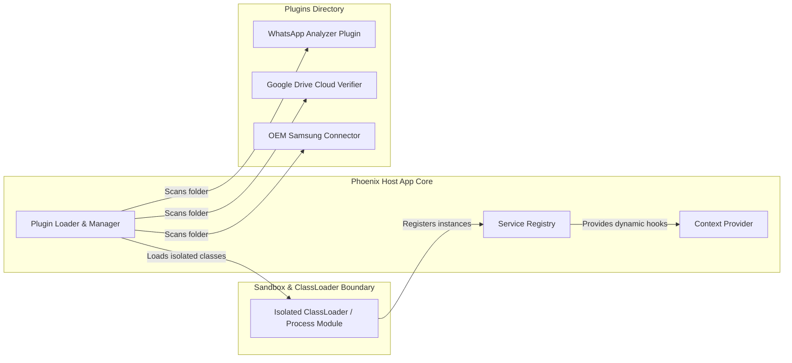

# Phoenix Backup Decision Suite: Plugin Architecture Design
## Role: Principal Security Architect & Android Platform Architect
## Execution Context: 100% Offline (Local Client PC)
## Document Version: 1.0.0

---

## 1. Architectural Overview & Coupling Strategy

The **Phoenix Backup Plugin Architecture** enables third-party developers and platform teams to extend the capabilities of the desktop suite without modifying the core codebase. This supports dynamic features such as deep application analysis, third-party cloud sync validations, app-specific recovery cards, and OEM-specific ADB communications.

### 1.1 Architecture & Separation Boundary

The system maintains a **Loose Coupling** design using isolated namespaces, a central service registry, and strict API boundaries:



---

## 2. Plugin Discovery & Versioning

### 2.1 Discovery Mechanism
The host application scans the local `%APPDATA%/phoenix-backup/plugins/` directory at startup. Each plugin must reside in its own subdirectory containing:
1.  `plugin.json`: The manifest file defining metadata, entry point, API version, and required permissions.
2.  `lib/`: Compiled class packages, script packages, or binaries.

### 2.2 Semantic Versioning Verification
To prevent runtime mismatch crashes, the loader enforces semantic versioning checks between the plugin's requested API version and the host’s current API.

*   **API Major Version Match:** The host rejects plugins whose `api_version` major number differs from the host's current runtime major number (e.g. a plugin built for API `2.1.0` will be rejected by a host running API `1.8.4`).
*   **API Minor Version Match:** If the plugin requires a newer minor version than the host provides, it is disabled (e.g. plugin requires API `1.5.0`, host runs `1.4.2`).

---

## 3. Security & Sandboxing Restrictions

To protect user privacy and system security, the Plugin Manager enforces strict execution boundaries:

1.  **Namespace & Dependency Isolation:** Plugins are loaded via unique, isolated ClassLoaders. They cannot share static memory namespaces or inspect other loaded plugins.
2.  **Explicit Host Permissions:** Plugins must declare their required system access capabilities inside `plugin.json` (e.g., `READ_LOCAL_STORAGE`, `EXECUTE_ADB_COMMANDS`). The host prompts the user to grant or deny these permissions during plugin activation.
3.  **Network Air-Gap Control:** Unless a plugin declares `NETWORK_ACCESS` (and the user explicitly approves it for cloud backup verifications), the ClassLoader strips socket libraries from the context, preventing unauthorized telemetry.

---

## 4. Lifecycle Specifications

Plugins transition through five states managed by the host lifecycle controller:

```mermaid
stateDiagram-fast
    [*] --> LOADED : Directory Scan & Manifest Read
    LOADED --> INITIALIZED : API Version & Dependency Verification Passed
    INITIALIZED --> ACTIVE : User Approves Permissions
    ACTIVE --> DISABLED : User Revokes / Host Safety Halt
    ACTIVE --> UNLOADED : App Shutdown / Hot-reload
    DISABLED --> ACTIVE : User Re-enables
    DISABLED --> UNLOADED : App Shutdown
    UNLOADED --> [*]
```

### 4.1 Lifecycle Callbacks
Each plugin must implement lifecycle event handlers:
*   `onLoad(context)`: Executed during manifest discovery. Used to register capabilities without loading resource-heavy classes.
*   `onInitialize(context)`: Verifies sandbox boundaries and hooks into event channels.
*   `onExecute(payload)`: The main execution loop called when auditing app configurations.
*   `onShutdown()`: Flushes local buffers, releases file hooks, and halts background threads safely.

---

## 5. Interface Contracts

The host exposes abstract plugin structures. (Note: These interfaces are described conceptually and via schema parameters, without source code implementation).

### 5.1 Base Interface: `IPlugin`
Every plugin must implement this core interface:
*   `getName()`: Returns unique string identifier.
*   `getVersion()`: Returns plugin version (e.g. `1.2.0`).
*   `getRequiredApiVersion()`: Returns minimum host API.
*   `getRequestedPermissions()`: Returns array of capability strings.

### 5.2 Specialty Interface: `IAppAnalyzerPlugin`
For deep-parsing of specific applications (e.g. WhatsApp, Signal):
*   `getTargetPackageName()`: Returns the package ID to monitor (e.g. `com.whatsapp`).
*   `analyzeApp(appDirectoryPath)`: Audits local database structures and returns custom warning or remediation recommendations.

### 5.3 Specialty Interface: `IBackupVerifierPlugin`
For verifying cloud backup states (e.g., Google Drive sync):
*   `getCloudServiceId()`: Returns identifier (e.g., `google_drive`).
*   `verifyBackupState(accountName, targetPackage)`: Validates if the target package backup is registered and synced on the cloud server.

### 5.4 Specialty Interface: `IDeviceOEMPlugin`
For OEM-specific hardware interfaces:
*   `getSupportedOemName()`: Returns OEM identifier (e.g., `Samsung`).
*   `onDeviceConnected(deviceModel, adbClient)`: Hooks custom transport protocols.

---

## 6. Example Plugin Configurations

### 6.1 WhatsApp Analyzer Plugin Manifest (`whatsapp-analyzer/plugin.json`)
```json
{
  "id": "phoenix.whatsapp.analyzer",
  "name": "WhatsApp Deep Analyzer",
  "version": "1.0.4",
  "api_version": "1.2.0",
  "entry_point": "phoenix.whatsapp.analyzer.WhatsAppPlugin",
  "description": "Scans local storage directories to verify the presence of encrypted database files and database structures.",
  "requested_permissions": [
    "READ_LOCAL_STORAGE",
    "READ_DEVICE_INVENTORY"
  ]
}
```

### 6.2 Google Drive Cloud Backup Verifier Manifest (`gdrive-verifier/plugin.json`)
```json
{
  "id": "phoenix.gdrive.verifier",
  "name": "Google Drive Sync Verifier",
  "version": "2.1.0",
  "api_version": "1.2.0",
  "entry_point": "phoenix.gdrive.verifier.GoogleDrivePlugin",
  "description": "Queries Google Drive API tokens to verify if application backups are safely uploaded.",
  "requested_permissions": [
    "NETWORK_ACCESS",
    "READ_DEVICE_INVENTORY"
  ]
}
```
