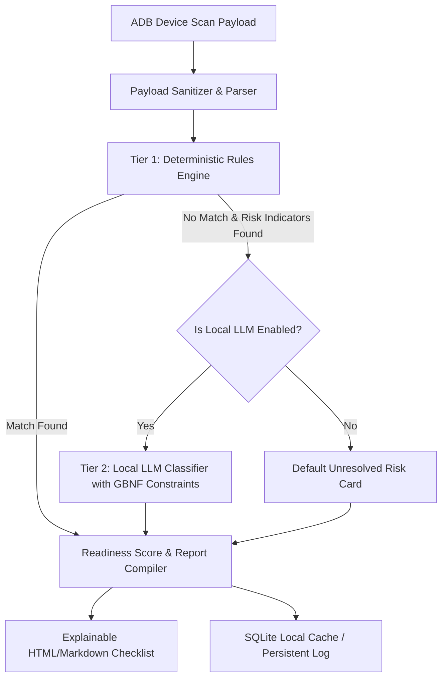

# Phoenix Backup Decision Suite: Recovery Intelligence Engine Design Document
## Role: Principal AI Architect
## Execution Environment: 100% Offline (Local Client PC)
## Document Version: 1.1.0

---

## 1. Executive Summary & Architecture Principles

The **Recovery Intelligence Engine** is a critical subsystem of the **Phoenix Backup** desktop suite. It is responsible for auditing device application state, identifying data recovery risks, assessing migration readiness, and producing human-understandable (explainable) remediation steps for the user before a device wipe or transition.

### 1.1 Core Principles
*   **Offline-First & Privacy-Preserving:** The engine operates entirely locally on the user's host machine. No scanned package configurations, app metadata, or device statistics are sent to remote APIs.
*   **Determinism-First:** Categorization relies on a high-performance deterministic rules engine (Tier 1). Matches must resolve instantly ($<10\text{ms}$) with zero memory overhead.
*   **Local LLM Fallback (Tier 2):** For unknown apps with risk indicators, a local, highly compressed LLM runs optionally on a dedicated background thread, strictly constrained by a context-free grammar to prevent structural or factual hallucinations.
*   **Explainable Analytics:** Every recovery risk identified must explain the underlying technical constraint (e.g., hardware-bound key, sandbox restriction, disabled backup agents) and provide concrete, actionable step-by-step instructions for the user.

---

## 2. System Architecture

The Recovery Intelligence Engine utilizes a tiered evaluation pipeline to process incoming device scan payloads:



### 2.1 Component Specifications

#### 2.1.1 Payload Sanitizer & Parser
Receives raw device info, package lists, and directory metrics from the ADB discovery module. It sanitizes names, flags empty fields, and extracts key features (e.g., permissions, apk package names, and directory paths).

#### 2.1.2 Tier 1: Deterministic Rules Engine
Evaluates package identifiers against a local compiled dictionary (`app_rules.json`). Matches are resolved via prefix trees (Tries) and regular expressions.

#### 2.1.3 Tier 2: Local LLM Classifier (Optional Fallback)
A background processor wrapper around `llama.cpp` using a quantized, high-efficiency model (e.g., *Qwen-2.5-3B-Instruct-Q4_K_M* or *Phi-3.5-mini-instruct-Q4_K_M*). It evaluates unknown package names and short descriptive strings against an offline prompt context and filters output through a **GBNF (Gerard-Bacus-Naur Form)** grammar rule to guarantee a well-formed JSON output schema.

#### 2.1.4 Aggregation & Scoring Module
Computes a unified **Recovery Readiness Score ($S$)** out of 100 based on standard backups, directory sync metrics, and remaining active risk penalties.

#### 2.1.5 Recommendation & Explanation Generator
Matches risk categories to templates containing dynamic instructions, explaining the system limitation and providing step-by-step user-actions.

---

## 3. Detection Heuristics & Rules (Goal Alignment)

### 3.1 Authenticator Apps Detection
Authenticator apps require strict detection because their dynamic OTP tokens (TOTP/HOTP) and security keys are locked to the device's hardware enclave (Android Keystore). They cannot be restored via standard ADB backups.

*   **Package Match Patterns:**
    *   `com.google.android.apps.authenticator2` (Google Authenticator)
    *   `com.microsoft.authenticator` (Microsoft Authenticator)
    *   `com.duosecurity.duomobile` (Duo Mobile)
    *   `com.authy.authy` (Twilio Authy)
    *   `net.aegis.aegis` (Aegis Authenticator)
    *   `org.yubikey.yubioath` (Yubico Authenticator)
    *   `co.bitwarden.authenticator` (Bitwarden Authenticator)
*   **Substring Filters:** Packages matching `.*(authenticator|2fa|totp|otp|token|auth).*`
*   **Risk Level:** `CRITICAL` (100% data loss risk on wipe).
*   **Technical Constraint:** Private keys are generated using `KeyGenParameterSpec` with `PURPOSE_SIGN` and hardware-backed storage, making the raw key material completely non-exportable outside of the secure element.

### 3.2 Banking & Financial Apps Detection
Banking apps store local sessions, transaction cache, and hardware-attested binding parameters. Transferring these apps to a new phone always triggers security blocks.

*   **Package Match Patterns:**
    *   `com.chase.sig.android` (Chase Mobile)
    *   `com.infonow.bofa` (Bank of America)
    *   `com.citibank.mobile.con` (Citibank)
    *   `com.capitalone.mobile` (Capital One)
    *   `com.binance.dev` (Binance)
    *   `com.wallet.crypto` (Trust Wallet)
    *   `io.metamask` (MetaMask)
*   **Substring Filters:** Packages matching `.*(bank|pay|wallet|card|m-banking|finance|crypto|ledger|trade|broker).*`
*   **Permissions Fingerprint:** Any application containing three or more of the following:
    *   `android.permission.USE_BIOMETRIC` or `android.permission.USE_FACIAL_RECOGNITION`
    *   `android.permission.NFC`
    *   `android.permission.SEND_SMS` or `android.permission.RECEIVE_SMS`
    *   `android.permission.BIND_DEVICE_ADMIN`
*   **Risk Level:** `HIGH` (Access lockout; requires verification codes, physical card details, or hardware registration).

### 3.3 High-Risk Apps Classification
This category comprises applications where user-generated data is encrypted locally and cloud sync is either disabled by default or non-existent.

*   **Secure Messengers:**
    *   `org.thoughtcrime.securesms` (Signal): DB uses local SQLCipher. Backup agent is disabled.
    *   `com.whatsapp` (WhatsApp): Database local encryption keys are in root-only sandboxes.
    *   `ch.threema.app` (Threema): All cryptographic identities are stored locally.
*   **Password Managers:**
    *   `com.x8bit.bitwarden` (Bitwarden)
    *   `com.onepassword.android` (1Password)
    *   `com.kunzisoft.keepass.free` (KeePassDX)
*   **Enterprise MDM & Workspace profiles:**
    *   `com.microsoft.intune` (Company Portal)
    *   `com.mobileiron.android.client` (MobileIron)
*   **Risk Level:** `CRITICAL` for secure messengers (permanent history loss), `HIGH` for password managers (vault lockouts if offline), and `CRITICAL` for MDMs (wipe triggers remote enterprise revoking).

### 3.4 Local-Only Data Identification
Files stored in generic shared folders or app sandboxes that do not declare standard cloud sync channels.

*   **Storage Scan Areas:**
    *   `/sdcard/DCIM/` & `/sdcard/Pictures/` (Un-synced media)
    *   `/sdcard/Download/` (Downloaded documents, PDFs, installation files)
    *   `/sdcard/Documents/` (Custom document structures)
    *   `/sdcard/Android/data/<package_name>/` (For game saves, e.g., Minecraft, offline mapping tools)
*   **Indicator Flags:**
    *   Apps with `allowBackup="false"` declared in their Android Manifest (retrieved via package dump analysis).
    *   Apps with no registered accounts under standard sync adapters (checked via `dumpsys account` command).
*   **Risk Level:** `MEDIUM` to `HIGH` (Local-only data will be permanently deleted unless manually backed up via raw storage copy).

---

## 4. Rule Definition Schema

Rules are declared in a structured format within `app_rules.json`. This configuration is updated out-of-band and checked locally.

### 4.1 JSON Schema Definition
```json
{
  "$schema": "http://json-schema.org/draft-07/schema#",
  "title": "PhoenixRecoveryRules",
  "type": "array",
  "items": {
    "type": "object",
    "required": ["package_pattern", "app_name", "category", "severity", "reasoning", "remediation"],
    "properties": {
      "package_pattern": {
        "type": "string",
        "description": "Regex or glob pattern matching the app package namespace."
      },
      "app_name": {
        "type": "string",
        "description": "Human-readable name of the application."
      },
      "category": {
        "type": "string",
        "enum": ["AUTHENTICATOR", "BANKING", "SECURE_MESSENGER", "PASSWORD_MANAGER", "LOCAL_DATA_APP", "ENTERPRISE_MDM"]
      },
      "severity": {
        "type": "string",
        "enum": ["CRITICAL", "HIGH", "MEDIUM", "LOW"]
      },
      "reasoning": {
        "type": "string",
        "description": "Explanation of the recovery limitation (why backup fails)."
      },
      "remediation": {
        "type": "string",
        "description": "Step-by-step user instructions to secure the app data."
      }
    }
  }
}
```

### 4.2 Curated Rule Dictionary Sample (`app_rules.json`)
```json
[
  {
    "package_pattern": "com.google.android.apps.authenticator2",
    "app_name": "Google Authenticator",
    "category": "AUTHENTICATOR",
    "severity": "CRITICAL",
    "reasoning": "TOTP security keys are stored in the hardware-backed keystore enclave. Android security policy prevents these keys from being backed up, extracted, or copied via ADB.",
    "remediation": "1. Open Google Authenticator on your phone.\n2. Tap the menu icon (top-right) and select 'Transfer accounts'.\n3. Select 'Export accounts' and verify your identity.\n4. Take a photo of the generated QR code or display it to scan on your new device."
  },
  {
    "package_pattern": "org.thoughtcrime.securesms",
    "app_name": "Signal",
    "category": "SECURE_MESSENGER",
    "severity": "CRITICAL",
    "reasoning": "Signal stores all chat history in a local SQLCipher database, encrypted with a key unique to this hardware. Signal explicitly flags its package to disable Android backups (allowBackup=false).",
    "remediation": "1. Open Signal and tap your Profile picture -> Settings.\n2. Select Chats -> Chat backups and tap 'Turn on'.\n3. Write down the 30-digit backup passphrase (store this securely!).\n4. Manually copy the backup file from /sdcard/Signal/Backups/ to your computer via USB."
  },
  {
    "package_pattern": "com.chase.sig.android",
    "app_name": "Chase Mobile",
    "category": "BANKING",
    "severity": "HIGH",
    "reasoning": "Chase Mobile utilizes hardware-attested device registration tokens. Copying the application to a new device will fail authentication and require fresh verification.",
    "remediation": "1. Confirm your Chase username, password, and security questions.\n2. Ensure your phone number is operational to receive SMS verification codes on the target hardware."
  },
  {
    "package_pattern": "com.mojang.minecraftpe",
    "app_name": "Minecraft PE",
    "category": "LOCAL_DATA_APP",
    "severity": "MEDIUM",
    "reasoning": "Minecraft save files are stored locally in the application storage space and do not sync to Google Drive cloud backups unless configured using custom Xbox Live servers.",
    "remediation": "1. Connect your device to your PC.\n2. Use the file explorer or ADB to copy '/sdcard/Android/data/com.mojang.minecraftpe/files/' to a secure folder on your PC.\n3. Restore this directory on your new device after reinstalling Minecraft."
  }
]
```

---

## 5. Recovery Readiness & Risk Scoring Framework

The engine evaluates readiness using a mathematical framework that models both positive recovery assets (verified backups) and negative modifiers (unresolved vulnerabilities/data loss hazards).

### 5.1 The Scoring Formula

$$S = \min\left(100, \max\left(0, S_{\text{base}} + S_{\text{storage}} - \sum_{i \in U} P(i)\right)\right)$$

Where:
*   **$S$**: The final Recovery Readiness Score ($S \in [0, 100]$).
*   **$S_{\text{base}}$**: Base Backups Component (Max: $45\text{ pts}$). Represents core communication backups.
    *   $C_{\text{contacts}} = 15\text{ pts}$ (if contacts `.vcf` backup is verified and non-empty)
    *   $C_{\text{sms}} = 15\text{ pts}$ (if SMS backup payload is verified and non-empty)
    *   $C_{\text{call\_logs}} = 15\text{ pts}$ (if call logs backup payload is verified and non-empty)
    *   $S_{\text{base}} = C_{\text{contacts}} + C_{\text{sms}} + C_{\text{call\_logs}}$
*   **$S_{\text{storage}}$**: Media/Storage Sync Component (Max: $55\text{ pts}$).
    *   Let $D$ be the set of user-selected storage directories for backup (e.g., Camera roll, Documents, Downloads).
    *   $S_{\text{storage}} = 55 \times \frac{\sum_{d \in D} \text{BytesSynced}(d)}{\sum_{d \in D} \text{TotalBytes}(d)}$
*   **$U$**: The set of all detected high-risk application findings that have **not** been resolved or acknowledged by the user.
*   **$P(i)$**: The risk penalty associated with finding $i$:
    *   `CRITICAL` finding: $P(i) = 15\text{ pts}$
    *   `HIGH` finding: $P(i) = 10\text{ pts}$
    *   `MEDIUM` finding: $P(i) = 5\text{ pts}$
    *   `LOW` finding: $P(i) = 0\text{ pts}$

### 5.2 Dynamic Recalculation Flow
1.  **Initial State:** The device is scanned. All high-risk apps are flagged as "Unresolved". Penalties apply, typically driving $S$ down.
2.  **Remediation Action:** The user reads the explainable recommendation and completes the manual steps (e.g., exports their Google Authenticator accounts).
3.  **User State Acknowledgment:** The user checks "I have completed this step" in the UI.
4.  **Recalculation:** The engine transitions finding $i$ from $U$ to $Resolved$. $P(i)$ is removed from the summation, and $S$ increases dynamically.

### 5.3 Readiness State Classification
*   **`READY` ($S \ge 90$):** Device is safe to wipe. All core backups are successful, storage sync is complete, and no critical risks remain unaddressed.
*   **`WARNING` ($70 \le S < 90$):** Base backups are secure, but some high-risk apps or media files have not been prepared for migration.
*   **`CRITICAL_UNPREPARED` ($S < 70$):** Major data loss is guaranteed. Critical risk items (authenticators, encrypted messengers) are unresolved, or base backups are missing.

---

## 6. Offline Local LLM Fallback (Tier 2)

When the Rules Engine detects unknown packages containing critical keywords (e.g., `bank`, `authenticator`, `pay`, `crypto`) or request-related security permission signatures, it routes those entries to the Local LLM fallback.

### 6.1 Model Requirements
*   **Execution Runtime:** `llama.cpp` shared library bindings in C/C++ or python sidecar execution.
*   **Target Models:** quantized GGUF format of *Qwen-2.5-3B-Instruct* or *Phi-3.5-mini-instruct* (4-bit quantization, e.g., `q4_k_m`).
*   **Resource footprint limits:**
    *   RAM consumption: $\le 3.5\text{ GB}$.
    *   Execution context limit: $1024$ tokens.
    *   Concurrency: Executed on a low-priority background thread to prevent UI micro-stutters.

### 6.2 Structured JSON Grammar (GBNF Spec)
To ensure the LLM returns valid JSON mapping our structured models exactly and never outputs conversational filler text, the generation is constrained by the following GBNF definition:

```gbnf
root ::= object
object ::= "{\n" ws "\"category\": " ws category ",\n" ws "\"severity\": " ws severity ",\n" ws "\"reasoning\": " ws string ",\n" ws "\"remediation\": " ws string "\n}"
category ::= "\"AUTHENTICATOR\"" | "\"BANKING\"" | "\"SECURE_MESSENGER\"" | "\"PASSWORD_MANAGER\"" | "\"LOCAL_DATA_APP\"" | "\"ENTERPRISE_MDM\"" | "\"UNKNOWN\""
severity ::= "\"CRITICAL\"" | "\"HIGH\"" | "\"MEDIUM\"" | "\"LOW\""
string ::= "\"" ([^"\\] | "\\" [\"\\/bfnrt] | "\\u" [0-9a-fA-F] [0-9a-fA-F] [0-9a-fA-F] [0-9a-fA-F])* "\""
ws ::= [ \t\n\r]*
```

### 6.3 Local Prompt Design
```
System: You are the offline classifier component for the Phoenix Android recovery tool. Your output must strictly follow the JSON template. Do not include introductory text, polite chat, or explanation blocks outside the JSON itself. Categorize Android packages into one of: AUTHENTICATOR, BANKING, SECURE_MESSENGER, PASSWORD_MANAGER, LOCAL_DATA_APP, ENTERPRISE_MDM. Determine threat severity as: CRITICAL, HIGH, MEDIUM, LOW.

Request: Analyze this app entry:
Package Name: com.coinstar.wallet
App Name: Coinstar Crypto
Declared Permissions: [android.permission.USE_BIOMETRIC, android.permission.INTERNET, android.permission.NFC]

Response:
```

---

## 7. Data Models

### 7.1 Input Data Model (`DeviceAuditPayload`)
Represents the structured data exported from the device discovery and inventory stages.

```json
{
  "$schema": "http://json-schema.org/draft-07/schema#",
  "title": "DeviceAuditPayload",
  "type": "object",
  "required": ["device_id", "api_level", "storage", "contacts_count", "sms_count", "call_log_count", "packages"],
  "properties": {
    "device_id": { "type": "string" },
    "api_level": { "type": "integer", "minimum": 1 },
    "storage": {
      "type": "object",
      "required": ["total_bytes", "used_bytes", "free_bytes"],
      "properties": {
        "total_bytes": { "type": "integer" },
        "used_bytes": { "type": "integer" },
        "free_bytes": { "type": "integer" }
      }
    },
    "contacts_count": { "type": "integer" },
    "sms_count": { "type": "integer" },
    "call_log_count": { "type": "integer" },
    "packages": {
      "type": "array",
      "items": {
        "type": "object",
        "required": ["package_name", "app_name", "apk_path"],
        "properties": {
          "package_name": { "type": "string" },
          "app_name": { "type": "string" },
          "apk_path": { "type": "string" },
          "permissions": {
            "type": "array",
            "items": { "type": "string" }
          }
        }
      }
    }
  }
}
```

### 7.2 Output Data Model (`RecoveryIntelligenceReport`)
Defines the structure of the payload passed to UI renderers and report exports.

```json
{
  "$schema": "http://json-schema.org/draft-07/schema#",
  "title": "RecoveryIntelligenceReport",
  "type": "object",
  "required": ["readiness_score", "readiness_state", "verdicts", "overall_assessment", "findings", "checklist"],
  "properties": {
    "readiness_score": { "type": "integer", "minimum": 0, "maximum": 100 },
    "readiness_state": { "type": "string", "enum": ["READY", "WARNING", "CRITICAL_UNPREPARED"] },
    "verdicts": {
      "type": "object",
      "required": ["contacts_ready", "sms_ready", "call_logs_ready"],
      "properties": {
        "contacts_ready": { "type": "boolean" },
        "sms_ready": { "type": "boolean" },
        "call_logs_ready": { "type": "boolean" }
      }
    },
    "overall_assessment": { "type": "string" },
    "findings": {
      "type": "array",
      "items": {
        "type": "object",
        "required": ["package_name", "app_name", "category", "severity", "reasoning", "remediation", "resolved"],
        "properties": {
          "package_name": { "type": "string" },
          "app_name": { "type": "string" },
          "category": { "type": "string" },
          "severity": { "type": "string" },
          "reasoning": { "type": "string" },
          "remediation": { "type": "string" },
          "resolved": { "type": "boolean" }
        }
      }
    },
    "checklist": {
      "type": "array",
      "items": {
        "type": "object",
        "required": ["task_id", "step", "priority", "timing", "status"],
        "properties": {
          "task_id": { "type": "string" },
          "step": { "type": "string" },
          "priority": { "type": "string", "enum": ["MUST", "SHOULD", "COULD"] },
          "timing": { "type": "string", "enum": ["PRE_RESET", "POST_RESTORE"] },
          "status": { "type": "string", "enum": ["PENDING", "COMPLETED"] }
        }
      }
    }
  }
}
```

---

## 8. Test Strategy

To verify the engine correctness and integrity without generating source code, we outline the testing parameters, inputs, and validation criteria.

### 8.1 Rules Engine Unit Tests
*   **Goal:** Ensure fast and accurate matching of deterministic rules without false triggers.
*   **Test Cases:**
    *   **TC-01 (Exact Match):** Feed the input package `org.thoughtcrime.securesms`. Verify that the rule engine returns the target metadata with `CRITICAL` severity and correct Signal-specific instructions.
    *   **TC-02 (Prefix / Wildcard Match):** Pass a custom package name like `com.chase.sig.android.subfeature`. Verify it matches the prefix rules for banking.
    *   **TC-03 (Negative Match):** Pass an unknown package name like `com.example.simplecalculator` with standard permissions. Verify it results in zero matches and does not trigger fallback LLM queues.

### 8.2 Scoring Framework Boundary Validation
*   **Goal:** Verify mathematical limits and dynamic updates of the readiness score.
*   **Test Cases:**
    *   **TC-04 (Worst Case):** Input device with:
        *   Zero contacts, SMS, and call logs backed up (0 pts).
        *   0% storage synced (0 pts).
        *   3 unresolved Critical app findings (-45 pts).
        *   *Expected Result:* Score is exactly `0` (clamped, not negative).
    *   **TC-05 (Best Case):** Input device with:
        *   Contacts, SMS, and Call logs verified (45 pts).
        *   100% storage synced (55 pts).
        *   No identified critical, high, or medium risk applications.
        *   *Expected Result:* Score is exactly `100`.
    *   **TC-06 (State Transitions):** Input device with one critical app finding (starting score: 85). Trigger the update action setting `resolved = true` on the critical app finding object.
        *   *Expected Result:* Score dynamically increments to `100`.

### 8.3 Local LLM Grammar Verification
*   **Goal:** Verify that the GBNF grammar parser rejects any invalid completions.
*   **Test Cases:**
    *   **TC-07 (Malformed Struct Rejection):** Feed the parsing validator mock tokens with conversational prefix text: `"Sure, here is the classification: { ... }"`. Ensure parser filters or rejects the prefix.
    *   **TC-08 (Valid JSON Completion):** Feed a generated output matching the schema. Verify that standard JSON libraries load it without parser errors.
